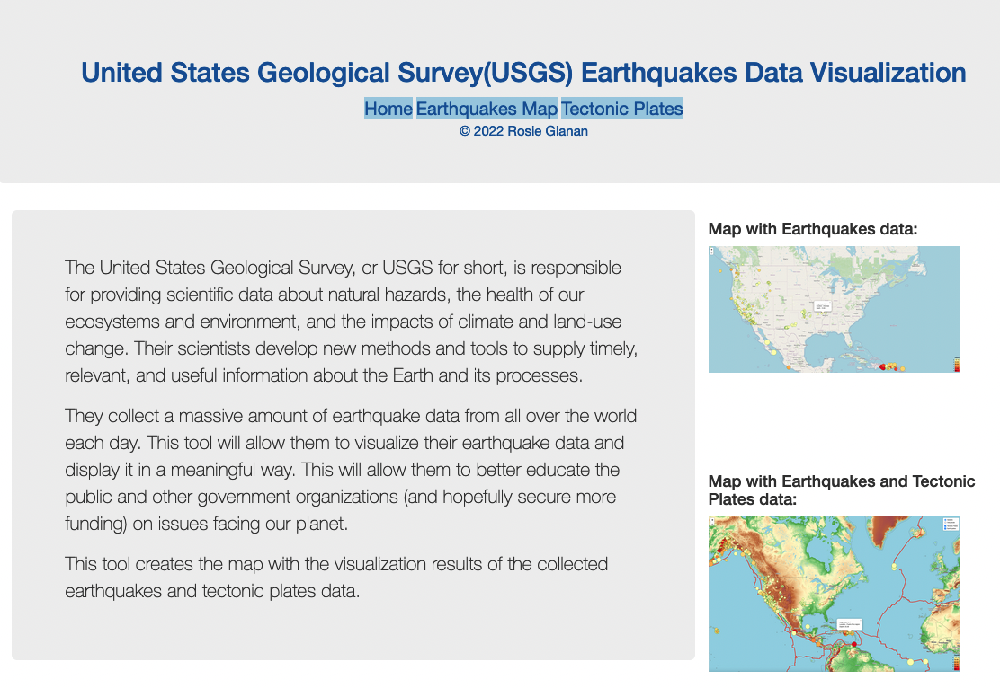

# United States Geological Survey (USGS) Earthquakes Data Visualization

Author: Rosie Gianan, gianr00@gmail.com

Website URL: https://gianr00.github.io/Visualizing_Earthquakes_Data_with_Leaflet/

Build with: JavaScript with D3.js, HTML, CSS, Leaflet, Visual Studio Code

## Objective:
The United States Geological Survey, or USGS for short, is responsible for providing scientific data about natural hazards, the health of our ecosystems and environment, and the impacts of climate and land-use change. Their scientists develop new methods and tools to supply timely, relevant, and useful information about the Earth and its processes. They collect a massive amount of earthquakes data from all over the world each day. 

This project builds a dashboard that visualizes the collected earthquakes and tectonic plates data and display them in a meaningful way. 

## Solution:
Create a dashboard that allows the user to select the data to be analyzed; (1) earthquakes data; (2) tectonic plates data. The dashboard displays the following maps based on the selected data:

1.    Map that plots the visualization results of the earthquakes data. 
2.    Map that plots the visualization results of the earthquakes and tectonic plates data. 

### Navigation Page: 

 

### Earthquakes map: 

 

### Tectonic Plates: 

